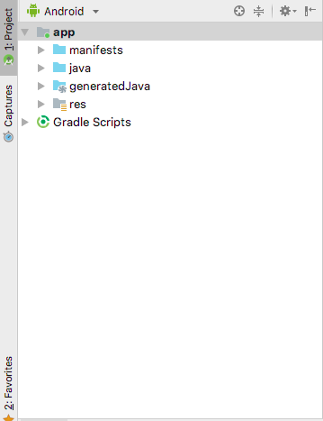
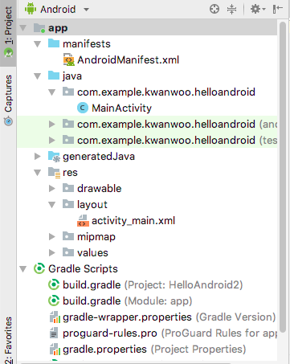
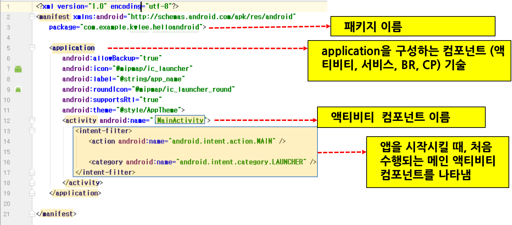
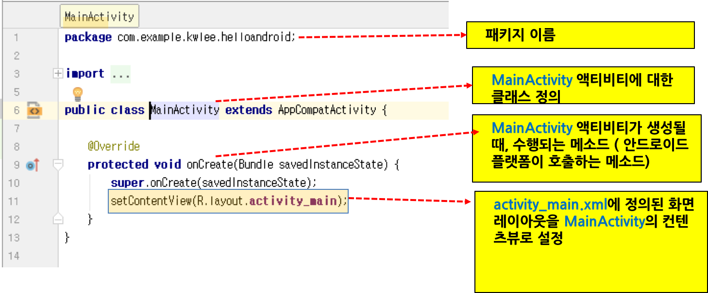
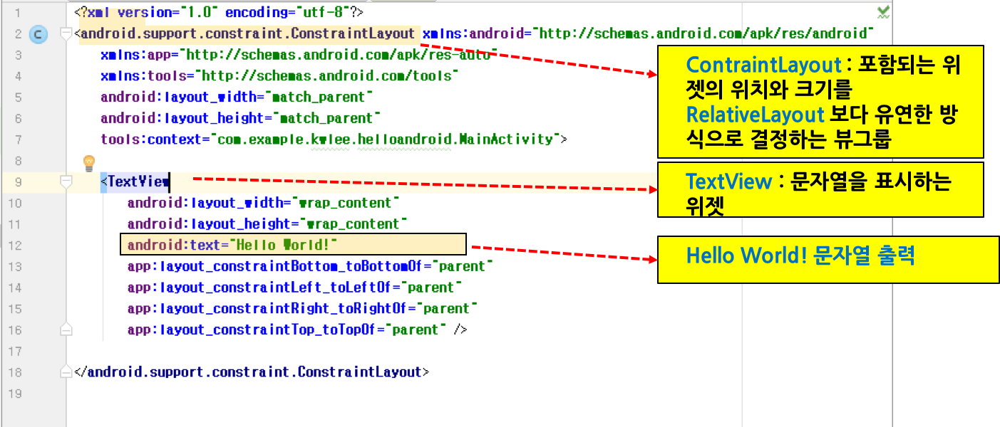
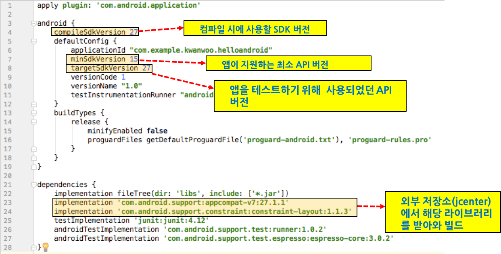

<style> 
div.polaroid {
  	width: 640px;
  	box-shadow: 0 10px 30px 0 rgba(0, 0, 0, 0.2), 0 16px 30px 0 rgba(0, 0, 0, 0.19);
  	text-align: center;
	margin-bottom: 0.5cm;
}
</style>

# 안드로이드 프로젝트 기본

## 1. HelloAndroid 프로젝트 구조 (Android 뷰)

개략 구조  | 상세 구조
------------- | -------------
 | 

- 안드로이드 앱 프로젝트는 크게 **매니페스트 파일 (manifests)**, **자바 소스 파일 (java)**, **리소스 파일 (res)**로 구성됨 

<a name="1.1"></a>
### 1.1 매니페스트 파일
- 앱의 기본 특징을 설명하고, 앱의 구성 요소인 컴포넌트(예, 액티비티, 서비스 등)를 정의한 XML 파일
- **AndroidManifest.xml**
	
	<div class="polaroid">
	
	</div>
	
	- [\<manifest\>](https://developer.android.com/guide/topics/manifest/manifest-element?hl=ko) 태그의 *package* 속성
		- 이 앱의 고유한 식별자 역할을 하는 패키지 이름이 정의
	- [\<application\>](https://developer.android.com/guide/topics/manifest/application-element?hl=ko) 태그
		- 이 앱을 구성하고 있는 컴포넌트를 \<application\> 태그 하위에 정의
		- 컴포넌트 종류에 따른 태그
			- 액티비티의 경우 [\<activity\>](https://developer.android.com/guide/topics/manifest/activity-element?hl=ko) 요소 
			- 서비스의 경우 [\<service\>](https://developer.android.com/guide/topics/manifest/service-element?hl=ko) 요소
			- 브로드캐스트 수신기의 경우 [\<receiver\>](https://developer.android.com/guide/topics/manifest/receiver-element?hl=ko) 요소
			- 콘텐츠 제공자의 경우 [\<provider\>](https://developer.android.com/guide/topics/manifest/provider-element?hl=ko) 요소
	- [\<activity\>](https://developer.android.com/guide/topics/manifest/activity-element?hl=ko) 태그
		- *android:name* 속성이 Activity 서브클래스의 완전히 정규화된 클래스 이름을 나타냄
		- 여기서는 이름이 *MainActivity*인 Activity 서브클래스가 앱을 구성하는 유일한 컴포넌트임 
	- [\<intent-filter\>](https://developer.android.com/guide/topics/manifest/intent-filter-element?hl=ko) 태그
		- 안드로이드 컴포넌트 (예, \<activity\> 태그) 하위에 포함되는 태그로서, 해당 컴포넌트가 수신할 수 있는 [인텐트](https://developer.android.com/guide/components/intents-filters?hl=ko)를 걸러내는 역할을 수행
		- 이 예제에서는 이름이 *MainActivity*인 액티비티 컴포넌트가 앱을 시작시키는 시작점으로서, 애플리케이션 론처(예, 홈 스크린)에 등록되어 있음을 나타냄.    

<a name="1.2"></a>
### 1.2 자바 소스 파일
- Android 앱은 Java 프로그래밍 언어로 작성
- **MainActivity.java**

	<div class="polaroid">
	
	</div>
	
	- 안드로이드 프로젝스 생성 시에 자동으로 만들어진 Java 파일

	
	- <span style="color:red;">package</span>  com.example.kwlee.helloandroid;
	
		- MainActivity 클래스가 속한 패키지
		- 안드로이드 프로젝트 생성 시에 설정된 이름 ([그림](https://kwanulee.github.io/Android/intro-android/figure/start-android/as-new-project.JPG))
		
	- public class MainActivity extends [AppCompatActivity](https://developer.android.com/reference/android/support/v7/app/AppCompatActivity)  
		- 안드로이드 액티비티는 [Activity](https://developer.android.com/reference/android/app/Activity)의 서브 클래스 임
		-  **AppCompatActivity**는 [Activity](https://developer.android.com/reference/android/app/Activity)의 서브클래스로서 하위 플랫폼 버전을 지원
			- 참고. [Activity와 AppCompatActivity의 차이](https://m.blog.naver.com/PostView.nhn?blogId=prez25&logNo=220984729217&proxyReferer=https%3A%2F%2Fwww.google.com%2F)   

	- protected void onCreate(Bundle savedInstanceState)
		- 안드로이드 플랫폼이 호출하는 메소드로서 액티비티가 생성되는 순간에 딱 한번 호출됨
		- 주로 액티비티와 관련된 변수 초기화 및 사용자 인터페이스 설정 코드를 포함함 
		
	- setContentView(*R.layout.activity_main*)
		- *R.layout.activity_main*이 가리키는 리소스를 이 액티비티의 콘텐츠뷰로 사용하겠다는 의미
		- *R.layout.activity_main*은 res/layout 폴더에 있는 activity\_main.xml을 가리키는 정적상수 (**R** 클래스에서 정의됨)

### 1.3 리소스 파일
- 애플리케이션 리소스(예, 이미지 혹은 문자열)를 Java 코드에서 분리하여 독립적으로 유지관리할 수 있도록 함으로써, 다양한 환경 변화(예, 화면크기 변화 혹은 사용 언어 변경)를 코드의 변경없이 수용할 수 있음.
	- 예를 들어, 여러가지 화면 크기에 따라 여러가지 UI 레이아웃을 리소스 파일로 제공하거나, 언어 설정에 따라 각기 다른 문자열을 리소스 파일로 제공할 수 있음. 
- 프로젝트의 res/ 디렉터리에 속한 특정 하위 디렉터리에 각 유형의 리소스를 배치

	```
	res/
	     drawable/  
	         ic_launcher_background.xml  
	     layout/  
	         activity_main.xml
	     mipmap/  
	         ic_launcher.png 
	     values/
	         colors.xml  
	         strings.xml  
	         styles.xml
	```
	- 더 자세한 내용은 다음 [링크](https://developer.android.com/guide/topics/resources/providing-resources?hl=ko)를 참조
- **activity_main.xml**

	<div class="polaroid">
	
	</div>
	
	- 화면의 레이아웃을 정의한 XML 파일
	- 이 파일은 ConstraintLayout 안에 하나의 TextView 요소가 포함된 화면 디자인을 나타냄
		- [ContraintLayout](https://developer.android.com/reference/android/support/constraint/ConstraintLayout)은 내부에 포함되는 위젯의 위치와 크기를 [RelativeLayout](https://developer.android.com/reference/android/widget/RelativeLayout) 보다 유연한 방식으로 결정하는 **뷰 그룹**
		- [TextView](https://developer.android.com/reference/android/widget/TextView)는 문자열을 표시하는 **위젯** 
			- <span style="color:blue">android:text</span> 속성에 지정된 문자열(Hello World!)을 표시	 

---
##2. 프로젝트 빌드[^build]
- Android 빌드 시스템은 앱 리소스 및 소스 코드를 컴파일하고, 배포할 수 있는 **APK**로 패키징함
- Android Studio는 고급 빌드 툴킷인 [Gradle](https://gradle.org/)을 사용하여 빌드 프로세스를 자동화하고 관리

### 2.1 빌드 프로세스


1. **컴파일러**는 소스 코드를 **DEX(Dalvik Executable)** 파일로 변환하고 그 외 모든 것을 **컴파일된 리소스**로 변환합니다. 
	- 이 DEX 파일에는 Android 기기에서 실행되는 바이트코드가 포함됨
2. **APK Packager**는 DEX 파일과 컴파일된 리소스를 **단일 APK에 결합**함 
3. 앱을 Android 기기에 설치하고 배포하기 위해서, **APK Packager**는 디버그 또는 릴리스 키스토어를 사용하여 **APK를 서명**
	1. **디버그 버전의 앱**(즉, 테스트 및 프로파일링 전용의 앱)을 빌드 중인 경우에는, 패키저가 디버그 키스토어로 앱에 서명함. *Android Studio는 디버그 키스토어로 새 프로젝트를 자동으로 구성함*
	2. **릴리스 버전의 앱**(즉, 외부에 릴리스할 앱)을 빌드 중인 경우에는, 패키저가 릴리스 키스토어로 앱에 서명함. (더 자세한 내용은 [Android Studio에서 앱 서명](https://developer.android.com/studio/publish/app-signing#studio)을 참조)
4. 최종 APK를 생성하기 전에, 패키저는 기기에서 실행될 때 더 적은 메모리를 사용하도록 앱을 최적화하기 위해 [zipalign](https://developer.android.com/studio/command-line/zipalign) 도구를 사용함

---
### 2.2 빌드 구성 파일
- 새 프로젝트를 시작할 때, 아래 그림과 같이 Android Studio가 프로젝트 구조를 생성하고, 빌드 구성 파일(**build.gradle(project level)**, **settings.gradle**, **build.gradle(module level)** 등)을 자동으로 만들고, *적합한 기본값*에 따라 파일에 값을 채움니다.
	
	

#### 2.2.1 build.gradle(Project level)
- 루트 프로젝트 디렉토리에 있는 최상위 build.gradle 파일은 프로젝트의 모든 모듈에 적용되는 빌드 구성을 정의


	```
	buildscript {
	    repositories {
	        google()
	        jcenter()
	    }
	    dependencies {
	        classpath 'com.android.tools.build:gradle:3.2.1'
	    }
	}
	
	allprojects {
	    repositories {
	        google()
	        jcenter()
	    }
	}
	
	task clean(type: Delete) {
	    delete rootProject.buildDir
	}
	```
	- **buildscript**{} 블록 : 모든 모듈에 공통되는 **Gradle** 리포지토리와 종속성을 정의 
	- **allprojects**{} 블록: 현 프로젝트의 모든 모듈에서 사용되는 리포지토리와 종송석을 정의

#### 2.2.2 settings.gradle
- 앱을 빌드할 때 어떤 모듈을 포함할지를 Gradle에 알려 줌
- 대부분의 프로젝트에서 이 파일은 간단하며 다음 코드만을 포함함

	```
	include ':app'
	```

	
#### 2.2.3 build.gradle(Module level)
- 이 파일이 위치하는 특정 모듈의 빌드 설정을 구성

	<div class="polaroid">
		
	</div>

	- **android**{} 블록: Android 특화된 빌드 옵션을 구성
		- *compileSdkVersion*: Gradle이 앱을 컴파일하기 위해서 사용하는 안드로이드 API 레베
		- *minSdkVersion*: 앱을 실행시키기 위해 요구되는 최소한의 API 레벨
		- *targetSdkVersion*: 앱을 테스트하기 위해 사용된 API 레벨
	- **dependencies**{} 블록: 모듈 자체를 빌드하기 위해 요구되는 종속성을 명세


	
##3. 참고자료
[^build]:  빌드구성, https://developer.android.com/studio/build/.